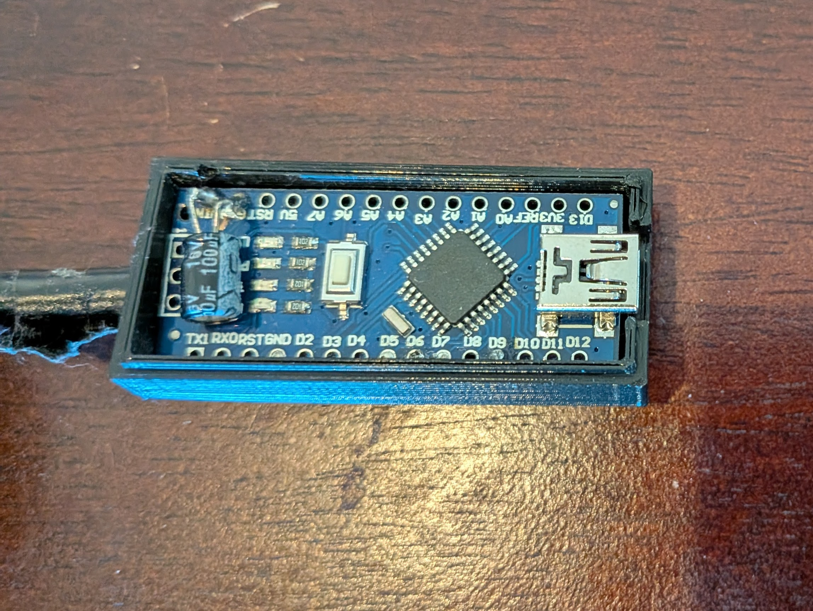
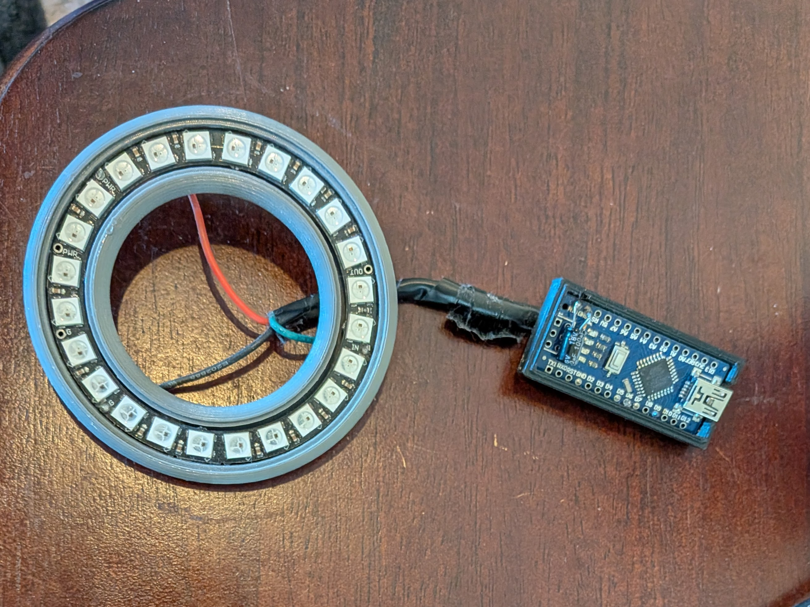
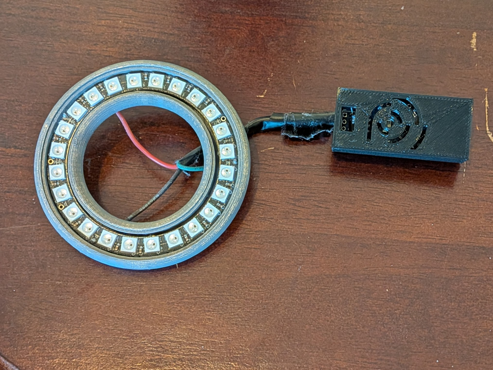
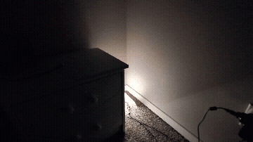
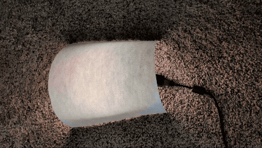

# Arduino Hardware Setup Guide

This guide covers the hardware components and wiring for the Arduino-based sunrise alarm clock.

## 📦 Bill of Materials

### Required Components

#### Microcontroller
- **Arduino Nano (or clone)** - ~$3-5
  - ATmega328P based
  - USB programmable
  - Compatible clones work great (CH340 chip)
  - **Note:** Can also use ESP32, ESP8266, or other Arduino-compatible boards


*Arduino Nano clone in a 3D printed protective case*

#### LEDs
Choose ONE of these options:

**Option A: LED Ring (Recommended for Alarm Clocks)**
- **24-Pixel WS2812B LED Ring** - ~$5-8
  - Part number: WS2812B 5050 RGB LED Ring
  - Compact circular form factor
  - Perfect for bedside alarm
  - Easy to diffuse with a globe/shade
  - Example: NeoPixel 24 LED Ring

**Option B: LED Strip (More Flexible)**
- **WS2812B LED Strip** - ~$8-12
  - 5V individually addressable RGB
  - 24-60 LEDs recommended (0.5-1 meter)
  - 60 LEDs/meter density preferred
  - Can be cut to length
  - Also known as: NeoPixels, WS2812, WS2811

#### Power Supply
- **USB Cable** (any standard USB-A to Mini/Micro USB)
  - Powers the Arduino Nano
  - For 24 LEDs, USB power is sufficient
  - Use quality cable for stable power

#### Smart Automation (Optional but Recommended)
- **Zigbee Smart Outlet** - ~$10-20
  - Compatible with Samsung SmartThings
  - Other options: Z-Wave, WiFi smart plugs
  - Any smart outlet that can be scheduled works

### Optional Components
- **1000µF Capacitor** - ~$1
  - Smooths power spikes
  - Connect across LED power terminals
  - Recommended for 60+ LEDs
- **Level Shifter** (3.3V to 5V)
  - Only needed if experiencing flickering
  - Arduino Nano outputs 5V so usually not required
- **Enclosure/Diffuser**
  - White globe or lamp shade
  - Frosted acrylic dome
  - 3D printed enclosure
- **Soldering Iron & Solder**
  - For permanent connections
  - Alternative: Use jumper wires with connectors

**Total Cost:** $15-30 depending on components chosen

---

## 🔌 Wiring Diagram

### Arduino Nano to WS2812B LED Ring/Strip

```
Arduino Nano              WS2812B LED Ring/Strip
┌──────────┐              ┌────────────────┐
│          │              │                │
│      D9  ├──────────────┤ DIN (Data In)  │
│          │              │                │
│     GND  ├──────────────┤ GND            │
│          │              │                │
│     5V   ├──────────────┤ 5V / VCC       │
│          │              │                │
└──────────┘              └────────────────┘
      │
      │ USB Cable
      │
   ┌──┴──┐
   │ USB │ ← Plugs into smart outlet
   └─────┘
```

### Pin Connections

| Arduino Nano Pin | LED Ring/Strip Pin | Function |
|------------------|-------------------|----------|
| D9 (Digital 9) | DIN / Data In | LED data signal |
| GND | GND / Ground | Common ground |
| 5V | 5V / VCC | Power supply |


*Actual wiring: Arduino Nano connected to 24-pixel WS2812B LED ring with 3D printed diffuser*

**Important Notes:**
- Data pin is configurable in code (`#define DATA_PIN 9`)
- Keep data wire as short as possible (< 6 inches ideal)
- For LED strips >60 LEDs, consider external 5V power supply

---

## 🛠️ Assembly Instructions

### Step 1: Prepare Components

**LED Ring/Strip:**
1. Identify the INPUT end (look for arrow or "DIN" label)
2. Note the three connection pads: 5V, GND, DIN
3. Pre-tin the pads with solder if soldering wires

**Arduino Nano:**
1. Insert into breadboard or prepare for direct soldering
2. Identify D9, GND, and 5V pins

### Step 2: Solder Connections

**Tools needed:**
- Soldering iron (30-40W)
- Lead-free solder
- Wire strippers
- 22-24 AWG stranded wire (red, black, and another color)

**Wire colors (recommended):**
- **Red** → 5V power
- **Black** → Ground
- **Yellow/Green/White** → Data signal

**Soldering steps:**
1. Cut three wires to appropriate length (keep data wire short)
2. Strip 1/4" from each end
3. Tin both the wires and the connection pads
4. Solder red wire: Arduino 5V → LED ring 5V
5. Solder black wire: Arduino GND → LED ring GND
6. Solder data wire: Arduino D9 → LED ring DIN
7. Inspect joints for cold solder (should be shiny, not dull)
8. Optional: Add heat shrink tubing or electrical tape for strain relief

**Alternative (No Soldering):**
- Use breadboard-friendly connectors
- Dupont jumper wires with headers
- Less permanent but easier to modify

### Step 3: Test Before Final Assembly

1. Connect Arduino to computer via USB
2. Upload the test sketch (see Software Setup below)
3. LEDs should light up in sequence
4. If nothing happens, check:
   - Correct LED input end (not output end)
   - Solid solder connections
   - Data pin matches code (`#define DATA_PIN 9`)

### Step 4: Mount/Enclose (Optional)

**For LED Ring:**
- Mount behind frosted globe or lamp shade
- 3D print a diffuser ring
- Use standoffs to position behind diffuser material

**For LED Strip:**
- Mount on aluminum channel for heat dissipation
- Add diffuser cover for smooth light
- Can wrap around frame or mount linearly

---

## 🏠 Smart Home Integration - Steve's Setup

### Hardware Used
- **Arduino Nano Clone** with CH340 USB chip
- **24-pixel WS2812B 5050 RGB LED Ring**
- **Standard USB cable** (Mini-USB to USB-A)
- **Zigbee Smart Outlet** (controlled by Samsung SmartThings)


*Steve's complete hardware setup: 24-pixel LED ring with 3D printed diffuser, connected to Arduino Nano in protective case*

### How It Works

```
Samsung SmartThings Hub
         │
         │ (Zigbee)
         ▼
   Smart Outlet ──── [plugged in]
         │
         │ USB Cable
         ▼
   Arduino Nano ──── [powers on]
         │
         │ Soldered wires
         ▼
    LED Ring ──── [starts sunrise sequence]
```

**Automation Flow:**
1. SmartThings scheduled automation triggers at wake time minus 30 minutes
   - Example: Alarm at 7:30 AM → Outlet turns on at 7:00 AM
2. Smart outlet powers on
3. Arduino Nano boots up (takes ~2 seconds)
4. Sunrise sketch starts automatically
5. LEDs gradually transition: Deep red → Orange → Golden yellow
6. After 30 minutes: Full brightness, ready to wake up!

### See It In Action


*The sunrise simulation gradually brightening in a dark room - simulates natural dawn light*

### SmartThings Setup

**Create Automation:**
1. Open SmartThings app
2. Tap **Automations** → **+** (Add)
3. **IF (Trigger):**
   - Condition: Time
   - Select time: 7:00 AM (or your wake time minus 30 minutes)
   - Days: Monday-Friday (or custom schedule)
4. **THEN (Action):**
   - Device: [Your Smart Outlet]
   - Action: Turn On
5. **Name:** "Morning Sunrise Alarm"
6. Save and test!

**Optional Enhancement:**
- Add a second action to turn OFF after 1 hour
- Prevents LEDs from staying on all day if you forget

---

## 📊 Power Consumption

### Current Draw Estimates

| Configuration | Typical Current | Notes |
|--------------|-----------------|-------|
| Arduino Nano (idle) | ~20 mA | Base consumption |
| 24 LEDs @ full white | ~1,440 mA | 60mA per LED max |
| 24 LEDs @ sunrise mid-point | ~700 mA | Varies by brightness |
| **24 LED setup total** | **~800 mA avg** | Safe for USB power |
| 60 LEDs @ full white | ~3,600 mA | Requires external PSU |

**USB Power Limits:**
- Standard USB 2.0: 500 mA
- USB 3.0: 900 mA
- Phone charger: 1,000-2,400 mA
- **For 24-LED ring:** USB power is adequate ✅
- **For 60+ LEDs:** Use external 5V 3A+ power supply

### ⚠️ Power setup for `SRM_Sunrise_Scheduled.ino`

The WiFi-scheduled variant (`arduino/standalone/SRM_Sunrise_Scheduled/SRM_Sunrise_Scheduled.ino`) needs to stay powered **continuously** so it can hold its WiFi connection and NTP-synced clock and watch for its own alarm time. Plug it into a wall adapter or always-on USB power — **not** the smart outlet described above, since that outlet's whole job (cutting power on a schedule) is what this variant replaces. The smart-outlet-scheduling setup above still applies to the other sketches (`SRM_Sunrise_Smooth.ino`, `SRM_Sunrise_NonBlocking.ino`, `SRM_Sunrise_ESP32.ino`).

---

## 🔧 Troubleshooting

### LEDs Don't Turn On

**Check:**
- ✅ USB cable connected and outlet powered on
- ✅ Correct LED input end (look for DIN/Data In marking)
- ✅ Arduino Nano is powered (LED on board should be lit)
- ✅ Code uploaded successfully
- ✅ `NUM_LEDS` in code matches actual LED count

**Test:**
```cpp
void loop() {
  leds[0] = CRGB::Red;  // Test first LED
  FastLED.show();
  delay(1000);
}
```

### Wrong Colors or Glitchy LEDs

**Check:**
- ✅ Color order setting in code:
  ```cpp
  FastLED.addLeds<WS2812B, DATA_PIN, GRB>(leds, NUM_LEDS);
  //                                  ^^^ Try RGB if colors are wrong
  ```
- ✅ Data wire is short and away from power cables
- ✅ Add 1000µF capacitor across power if flickering
- ✅ Ensure common ground between Arduino and LEDs

### Only Some LEDs Work

**Check:**
- ✅ LED count in code: `#define NUM_LEDS 24`
- ✅ Power supply adequate for LED count
- ✅ No damaged LEDs in the chain (bypass suspect LED)

### Sunrise Too Fast/Slow

**Adjust in code:**
```cpp
#define SUNRISE_MINUTES 30  // Change to 15, 45, 60, etc.
```

---

## ⚡ Safety Notes

- Don't exceed 5.5V on LED power pins (WS2812B max voltage)
- Keep power wires thick enough for current (22-24 AWG minimum)
- Add fuse to external power supplies (3A recommended)
- Check solder joints don't create shorts
- Don't look directly at LEDs at full brightness

---

## 🎨 Enclosure Ideas

### Steve's Recommended Setup (Proven Build)

**Arduino Nano Enclosure:**
- **3D Printable Case:** [Arduino Nano Case on Thingiverse](https://www.thingiverse.com/thing:608121)
- Simple snap-fit design
- Protects board and provides mounting points
- Access holes for USB and pins

**LED Ring Diffuser:**
- **3D Printable Ring Diffuser:** [LED Ring Diffuser on Thingiverse](https://www.thingiverse.com/thing:3286646)
- Designed specifically for WS2812B rings
- Creates smooth, even light distribution
- Professional-looking finish

**Ready-Made Option (No 3D Printer Required):**
- **IKEA FADO Table Lamp:** [$29.99 - Buy here](https://www.ikea.com/us/en/p/fado-table-lamp-white-10096386/)
- Perfect fit for 24-pixel LED ring
- Frosted white globe provides beautiful diffusion
- Just remove the IKEA electronics and mount your LED ring inside
- Result: Professional-looking bedside sunrise alarm

**Complete Build Setup:**
1. Print Nano case and LED ring diffuser (or use IKEA Fado)
2. Mount Nano case near outlet (double-sided tape or screws)
3. Route wires cleanly to LED ring
4. Place LED ring with diffuser on nightstand
5. Plug USB cable into smart outlet

---

### Other Enclosure Options

### Simple Options
- **Lamp shade:** Place LED ring behind frosted glass lamp shade
- **Globe light:** Use IKEA-style paper globe lantern (Fado recommended)
- **Picture frame:** Mount behind frosted acrylic in deep frame

### 3D Printable Designs
- Cylindrical diffuser with top opening
- Dome with mounting clips for LED ring
- Adjustable angle bracket for bedside mounting
- **Steve's tested picks above** ⬆️

### DIY Frosted Diffuser
- White acrylic sheet (1/8" thick)
- Sand one side with fine sandpaper for diffusion
- Or use frosted contact paper on clear acrylic

### Diffused Light Result


*The sunrise effect with a diffuser creates soft, even light distribution - much easier on the eyes!*

---

## 🔄 Upgrading to More LEDs

**Going from 24 to 60 LEDs:**

1. **Update code:**
   ```cpp
   #define NUM_LEDS 60  // Change from 24
   ```

2. **Add external power:**
   - 5V 3A+ power supply
   - Connect ground to Arduino ground
   - Power LEDs separately from 5V supply
   - Arduino still powered via USB

3. **Wiring changes:**
   ```
   USB Cable → Arduino Nano
   5V PSU → LED Strip 5V (don't connect to Arduino)
   Arduino GND ↔ LED GND ↔ PSU GND (common ground)
   Arduino D9 → LED DIN
   ```

---

## 📝 Parts Shopping List

**Amazon/AliExpress Search Terms:**
- "Arduino Nano CH340"
- "WS2812B 24 LED Ring"
- "NeoPixel 24 Ring"
- "Zigbee Smart Plug SmartThings"
- "5V WS2812B LED Strip 60/m"

**Recommended Sellers:**
- Adafruit (Premium, US-based)
- BTF-LIGHTING (Good quality, affordable)
- AliExpress (Budget option, longer shipping)

---

## 🎓 Next Steps

Once hardware is assembled:
1. **[Software Setup](../arduino/README.md)** - Install Arduino IDE and upload code
2. **[SmartThings Configuration](#smart-home-integration-steves-setup)** - Set up automation
3. **[Customization Guide](../README.md#customization)** - Adjust colors and timing
4. **[Troubleshooting](troubleshooting.md)** - Fix common issues

---

**Questions?** Open an [issue](https://github.com/SteveMoodyData/sunrise-alarm-clock/issues) or [discussion](https://github.com/SteveMoodyData/sunrise-alarm-clock/discussions)!
